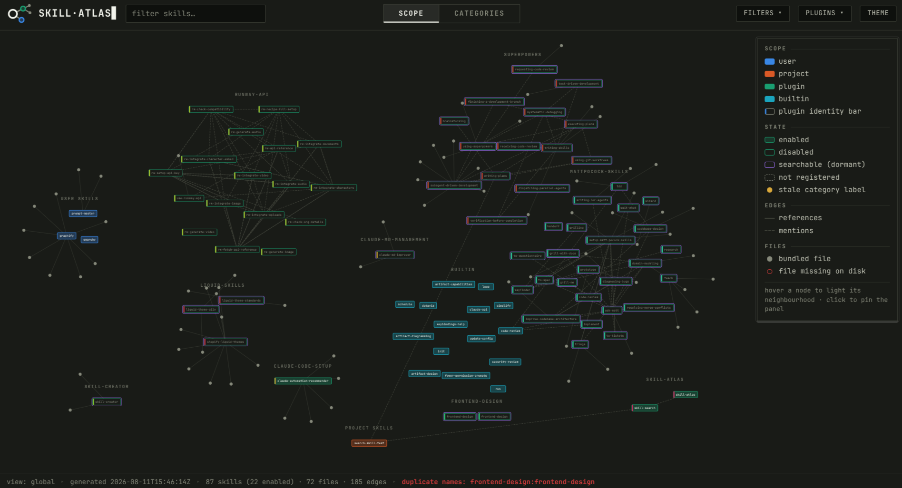
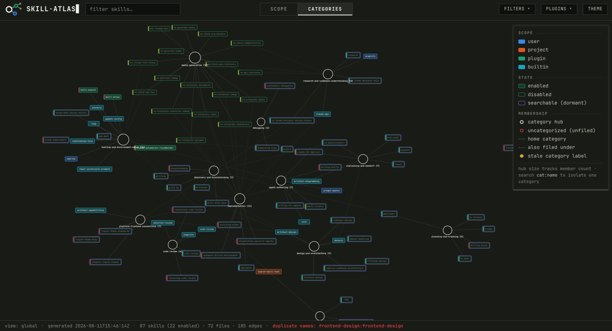

<div align="center">


# Skill Atlas

<h3>🔎 Query your whole skill collection at ~85% fewer tokens</h3>

**A third tier for Claude Code skills — dormant, zero tokens, still findable.**
Search a graph of your collection instead of preloading it.

<sub>53 skills, 6 kept enabled: **2,544 → 338 tokens per session (−86.7%)**. The other
47 cost nothing until asked for.</sub>

</div>



---

## ⚡ Install

```bash
git clone https://github.com/danielLublinsky/Skill_Atlas.git
claude plugin marketplace add ./Skill_Atlas
claude plugin install skill-atlas@skill-atlas
```

Python 3 only — no dependencies, no network (d3 is vendored).

## ▶️ Run

| Command | What it does |
| --- | --- |
| **`/skill-atlas`** | Build the graph, categorize what's new, render `atlas.html`. **Run this once to set up.** |
| **`/skill-atlas:edit-searchable`** | Move plugins in and out of the searchable tier, interactively. |
| *(automatic)* | A SessionStart hook keeps everything fresh after that. |

Then open `./.claude/skill-atlas/atlas.html` in a browser, and ask for a task —
`skill-search` finds the right dormant skill on its own.

<details>
<summary>Without the plugin (Makefile)</summary>

```bash
make build    # graph.json + catalog/ from your live manifests
make render   # atlas.html
make check    # CI gate: exit 1 on any broken reference or dangling mention
make test     # unit suite against fixtures — never touches the real ~/.claude
```

</details>

---

## 🎯 The problem

Claude Code injects **every** enabled skill's description into **every** session —
~48 tokens each. At 100+ skills that's thousands of tokens you pay for constantly,
and near-duplicates quietly compete for the model's attention.

Disabling fixes the cost and loses the skill. So Skill Atlas adds a tier in between:

| Tier | In context? | Findable? | Cost / session |
| --- | --- | --- | --- |
| 🟢 **enabled** | yes | natively | ~48 tokens each |
| 🟣 **searchable** | **no** | via `skill-search` | **0** |
| ⚫ **disabled** | no | no | 0 |

A **searchable** skill is dormant — its description never enters your context, but
it stays discoverable on demand. All that advertises the whole dormant tier is one
~50-token line at session start.

## 🔍 Search reads two files — never the catalog


**Two reads, ~1.5k tokens — against the ~8.3k the flat catalog would cost**, and
paid only when a search actually happens. Counts overlap on purpose, so the pick
doesn't have to land on *the* right bucket, only *a* right one. Tier-off skills are
excluded when shards are written, so a disabled plugin can never return through a
side door.

**The model categorizes once.** The first run drafts 8–12 categories named for
*user-intent task shapes*, not products, then freezes the taxonomy. Later runs only
file new skills and re-confirm the ones whose description changed — each assignment
carries a hash of the description it was made against.

## 🕸️ The graph



Discovery is **manifest-driven** — `installed_plugins.json` → each `plugin.json` →
settings — so marketplace catalogues and stale cached versions never pollute the
picture. (The naive "every directory with a SKILL.md" count over-counts by ~60% on a
real machine: `build_graph.py --naive-count`.)

Skills are nodes. The edges are the interesting part:

| | Edge | Caught |
| --- | --- | --- |
| 🔗 | **references** — a skill → its own bundled files | **broken** when the file isn't there |
| 💬 | **mentions** — a skill naming another skill | **dangling** when the target is `disabled`, `unregistered` or `absent` |

Mention matching is deliberately strict — only backticked, `skills/<name>`, or
unambiguous hyphenated names, code fences stripped first. Loose matching produced 91
edges on a 41-skill collection, almost all of them ordinary English words. You also
get duplicate names, orphans, and an exit code to gate CI on.

`atlas.html` is self-contained and opens from `file://` with zero network requests:
**scope** (origin, state, breakage in red) and **categories** (hub-and-spoke — solid
edge to the home category, dashed to the rest; search `cat:<name>` to isolate).

## 📦 State

All project-local, in `./.claude/skill-atlas/`.

> **Commit `categories.json`** — your curated taxonomy, and the one file that isn't a
> rebuildable cache. The first build drops a `.gitignore` covering the derived
> siblings; commit that too. (A repo that ignores `.claude/` wholesale needs negation
> rules first.)

A plugin is searchable only when **both** halves hold — Claude Code has it disabled,
*and* this scope opted it in. `edit-searchable` does both. The unit is a plugin, not
a single skill.

Skill Atlas reads manifests and skill files only. It never opens `~/.claude/projects`,
and it deliberately does not track usage.

## 📚 Docs

[**DESIGN.md**](DESIGN.md) — graph and visualization ·
[**DESIGN-PHASE2.md**](DESIGN-PHASE2.md) — categorization and search
