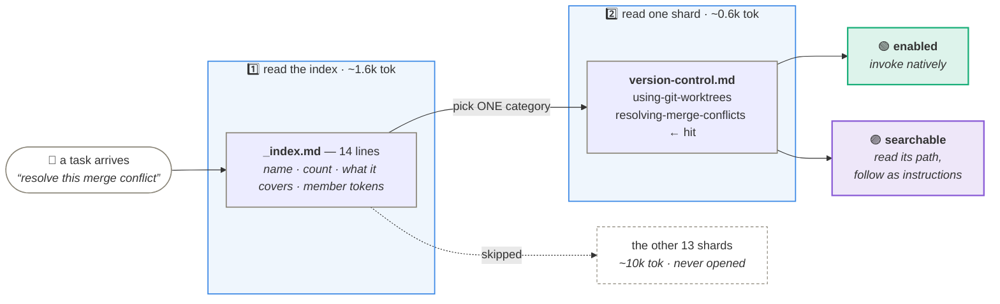
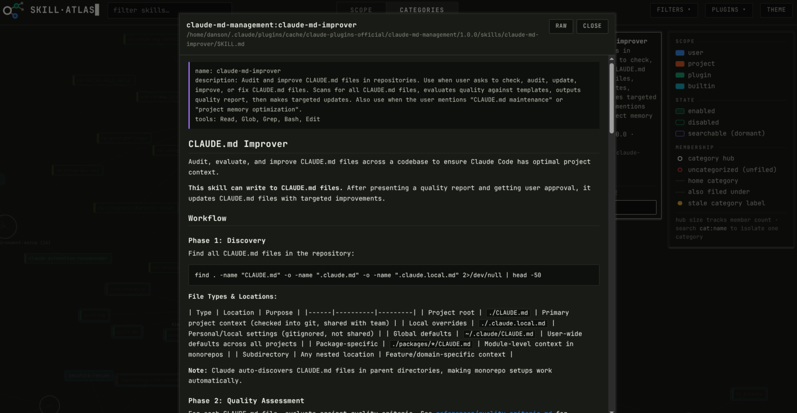

<div align="center">


# Skill Atlas

<h3>🔎 Query your whole skill collection at ~85% fewer tokens</h3>

**A third tier for Claude Code skills — dormant, zero tokens, still findable.**
Search a graph of your collection instead of preloading it.

<sub>53 skills, 6 kept enabled: **2,544 → 338 tokens per session (−86.7%)**. The other
47 cost nothing until asked for.</sub>

[](https://github.com/danielLublinsky/Skill_Atlas/actions/workflows/ci.yml)

</div>


---

## ⚡ Install

```bash
claude plugin marketplace add danielLublinsky/Skill_Atlas
claude plugin install skill-atlas@skill-atlas
```

Python 3 only — no dependencies, no network (d3 is vendored). Later:
`claude plugin update skill-atlas@skill-atlas`.

<details>
<summary>From a local clone (for hacking on it)</summary>

```bash
git clone https://github.com/danielLublinsky/Skill_Atlas.git
claude plugin marketplace add ./Skill_Atlas
claude plugin install skill-atlas@skill-atlas
```

</details>

## ▶️ Run

| Command | What it does |
| --- | --- |
| **`/skill-atlas`** | Build the graph, categorize what's new, render `atlas.html`. **Run this once to set up.** |
| **`/skill-atlas:edit-searchable`** | Move plugins in and out of the searchable tier, interactively. |
| **`/skill-atlas:skill-search`** | Find the right skill for a task across the whole library, dormant tier included. Usually you never type this — Claude calls it on its own before a nontrivial task. |
| *(automatic)* | A SessionStart hook keeps everything fresh after that. |

Then open `./.claude/skill-atlas/atlas.html` in a browser, and just ask for a
task — the search runs itself, names the skill it picked in one line, and gets
on with the work.

<details>
<summary>Without the plugin (Makefile)</summary>

```bash
make build    # graph.json + catalog/ from your live manifests
make render   # atlas.html
make check    # CI gate: exit 1 on any broken reference or dangling mention
make test     # unit suite against fixtures — never touches the real ~/.claude
make release  # bump both manifests, validate, test, commit, tag — never pushes
```

The plugin cache is keyed by version, so a push without a bump ships no code to
anyone already installed. `make release` (or `BUMP=minor`, `VERSION=1.0.0`) is
what makes a change land.

</details>

---

## 🎯 The problem

Claude Code injects **every** enabled skill's description into **every** session —
~48 tokens each. At 100+ skills that's thousands of tokens you pay for constantly,
and near-duplicates quietly compete for the model's attention.

Disabling fixes the cost and loses the skill. So Skill Atlas adds a tier in between:

| Tier | In context? | Findable? | Cost / session |
| --- | --- | --- | --- |
| 🟢 **enabled** | yes | natively | ~48 tokens each |
| 🟣 **searchable** | **no** | via `skill-search` | **0** |
| ⚫ **disabled** | no | no | 0 |

A **searchable** skill is dormant — its description never enters your context, but
it stays discoverable on demand. All that advertises the whole dormant tier is one
~50-token line at session start.

## 🔍 Search reads two files, not the catalog



**A search costs ~2.4k tokens** — the index (1.6k), one shard (~0.6k) and the
search skill itself (0.4k) — **and you pay it only when a search happens.** The
alternative it replaces is every dormant description sitting in context from
session start, billed whether you search or not. The arbitrage is real when
searches are occasional; it is not free, and the numbers above are measured
rather than estimated.

One shard is the norm. A second is opened only when the entry you found lists a
category you haven't read — the catalog pointing, not the model guessing — and
never a third. Counts overlap on purpose, so the pick doesn't have to land on
*the* right bucket, only *a* right one. Tier-off skills are excluded when shards
are written, so a disabled plugin can never return through a side door. The
result is announced in one line before the work continues: search is a lookup
inside a task, not a deliverable.

**The model categorizes once.** The first run drafts 8–12 categories named for
*user-intent task shapes*, not products, then freezes the taxonomy. Later runs only
file new skills and re-confirm the ones whose description changed — each assignment
carries a hash of the description it was made against.

## 🕸️ The graph


Discovery is **manifest-driven** — `installed_plugins.json` → each `plugin.json` →
settings — so marketplace catalogues and stale cached versions never pollute the
picture. (The naive "every directory with a SKILL.md" count over-counts by ~60% on a
real machine: `build_graph.py --naive-count`.)

Skills are nodes. The edges are the interesting part:

| | Edge | Caught |
| --- | --- | --- |
| 🔗 | **references** — a skill → its own bundled files | **broken** when the file isn't there |
| 💬 | **mentions** — a skill naming another skill | **dangling** when the target is `disabled`, `unregistered` or `absent` |

Mention matching is deliberately strict — only backticked, `skills/<name>`, or
unambiguous hyphenated names, code fences stripped first. Loose matching produced 91
edges on a 41-skill collection, almost all of them ordinary English words. You also
get duplicate names, orphans, and an exit code to gate CI on.

`atlas.html` is self-contained and opens from `file://` with zero network requests:
**scope** (origin, state, breakage in red) and **categories** (hub-and-spoke — solid
edge to the home category, dashed to the rest; search `cat:<name>` to isolate).

## 🛠️ Building and debugging skills



- **What's really registered** — discovery is manifest-driven, so unregistered copies
  and stale plugin caches surface as their own nodes instead of quietly counting.
- **Broken bundles** — a `references` edge whose file isn't on disk draws red, so a
  typo'd `references/foo.md` is visible without opening anything.
- **Why it didn't trigger** — tier is the node's fill (enabled · searchable ·
  disabled), and duplicate names are called out in the footer with both nodes drawn.
- **Read it in place** — pin any skill or bundled file and hit **open markdown** to
  read the source in a popup without leaving the graph.

## 📚 Docs

[**docs/**](docs/) — component guide, numbered 1–9: start at
[overview](docs/1-overview.md), then jump to the component you're touching
(discovery, graph build, categorization, catalog & search, rendering, hooks).

[**DESIGN.md**](DESIGN.md) — the historical record for both phases: what was
considered, what was chosen, what was dropped, and why

## ⚖️ License

Apache-2.0 — see [LICENSE](LICENSE).

D3 is vendored in [vendor/d3.v7.min.js](vendor/d3.v7.min.js) and inlined into
every generated `atlas.html`. It is ISC-licensed, © 2010-2023 Mike Bostock —
see [vendor/LICENSE-d3](vendor/LICENSE-d3).
